# M031BSP_I2C_Slave_SMBus

Nuvoton M031/M032 SMBus transaction-layer slave firmware validation.

Last updated: 2026/06/27

## Overview

The firmware focuses on a standards-aligned SMBus slave transport path:

- SMBus slave addressing and repeated START handling
- SMBus transaction-layer examples without any product command-set meaning
- PEC generation and validation using CRC-8 polynomial `0x07`
- Software SCL-low timeout sampling and bus-clear recovery
- Runtime debug logs for RX decode and TX payload traceability
- Deterministic example commands for a user-selected SMBus validation tool
- Compile-time sample profile selection for Generic SMBus layer validation or
  SFF-TA-1005 UBM Controller shell validation

This workspace is a standalone SMBus transaction-layer sample. SMBus defines
transaction forms, PEC, and timeout behavior; it does not define a product
command namespace. The example command bytes in this firmware are local
validation fixtures only. Product firmware can replace the example map with its
own command meanings while keeping the SMBus transport, PEC, and recovery code.

## Target Hardware

| Item | Value |
| --- | --- |
| MCU | Nuvoton M031/M032 series |
| Project board | M031 EVB, M032 board, or compatible custom board |
| SMBus role | SMBus slave |
| Default slave address | `0x5A`, 7-bit |
| SMBus bus speed | 400 kHz validation target |
| Toolchain | Keil uVision5 with ARM Compiler 6 |
| Debug UART | UART0, 115200 8N1 |

Hardware SMBus note:

- This firmware uses the normal I2C slave controller plus software SMBus handling.
- It must not depend on hardware SMBus Bus Management / PEC registers such as `I2C_BUSCTL`, `I2C_BUSTCTL`, `I2C_BUSSTS`, `I2C_PKTSIZE`, `I2C_PKTCRC`, `I2C_BUSTOUT`, or `I2C_CLKTOUT`.
- PEC, block transaction sizing, and transaction dispatch are implemented in software.
- Software SCL-low timeout is sampled from the 1 ms timer path. The default timeout threshold is `SMBUS_I2C_CLOCK_LOW_TIMEOUT_MS=35U`.
- Any ordinary I2C timeout counter used by the port layer is only a recovery aid; the software SCL-low monitor is the portable SMBus clock-low timeout path for this target.

## Pin Map

| Signal | Pin | Direction | Notes |
| --- | --- | --- | --- |
| SMBUS_SCL | PB5 default | Input/output | Default `SMBUS_PORT_OPTION_M031_I2C0_PB4_PB5`, I2C0 SCL, open-drain, external pull-up required |
| SMBUS_SDA | PB4 default | Input/output | Default `SMBUS_PORT_OPTION_M031_I2C0_PB4_PB5`, I2C0 SDA, open-drain, external pull-up required |
| UART0_RXD | PB12 | Input | Debug UART RX |
| UART0_TXD | PB13 | Output | Debug UART TX |
| HEARTBEAT | PB14 | Output | 1 second heartbeat toggle |
| GPIO_SPARE | PB15 | Output | Initialized spare output |

Alternate I2C port example:

| Option | SCL | SDA |
| --- | --- | --- |
| `SMBUS_PORT_OPTION_M031_I2C0_PB4_PB5` | PB5 | PB4 |
| `SMBUS_PORT_OPTION_M031_I2C1_PA2_PA3` | PA3 | PA2 |

## Repository Layout

```text
Library/                                   Nuvoton BSP and driver library
SampleCode/Template/main.c                 Main firmware entry point
SampleCode/Template/board_config.h         Board-level pin and SMBus defaults
SampleCode/Template/misc_config.*          Clock, UART, GPIO, timer setup
SampleCode/Template/smbus_io.*             Platform glue for SMBus IO behavior
SampleCode/Template/smbus/                 SMBus protocol, dispatch, PEC, and driver code
SampleCode/Template/Keil/Template.uvprojx  Keil project
SampleCode/Template/SMBUS_SUPPORT_MATRIX.md
SampleCode/Template/SMBUS_VALIDATION_CHECKLIST.md
```

The repository root also keeps validation logs and LA screenshots:

- `teraterm_GENERIC.log`: MCU-side Generic profile validation log.
- `teraterm_UBM.log`: MCU-side UBM Controller profile validation log.
- `cmd_*`, `W_*`, and `R_*` images: Generic SMBus transaction LA captures.
- `UBM_*` images: UBM Controller command LA captures.

## Build

Open the Keil project:

```text
SampleCode/Template/Keil/Template.uvprojx
```

Expected build outputs:

```text
SampleCode/Template/Keil/obj/template.axf
SampleCode/Template/Keil/obj/template.hex
SampleCode/Template/Keil/obj/template.bin
```

## Runtime Behavior

At startup, the firmware initializes system clock, GPIO, UART0, Timer1, SysTick,
timer service, and SMBus slave service.

The SMBus bus-critical path is handled in the I2C/SMBus interrupt path.

Background code is used for debug printing and non-critical housekeeping only.

This is intentional: SLA+W, SLA+R, repeated START, STOP, PEC, and TX byte
preparation must not depend on slow background logging.

Software SCL-low timeout sampling is not done in the polling loop. The 1 ms
timer path calls `smbus_drv_timer_1ms()`, which samples SMBUS_SCL once per
millisecond and latches recovery when SCL stays low for
`SMBUS_I2C_CLOCK_LOW_TIMEOUT_MS`. The actual bus-clear/re-open sequence runs in
`smbus_drv_background_task()` so the timer ISR remains short.

The timeout sampler guards shared SMBus driver state by disabling/enabling only
the I2C NVIC IRQ through `smbus_io_i2c_irq_guard()`. It does not toggle the I2C
peripheral interrupt enable bit.

Command-only repeated-start reads use the normal SMBus combined-format flow.
`STOP_RESTART` only saves the pending command context; `SLA_R_ACK` restores that
context, dispatches/prepares the SMBus response, writes the first response byte
to I2C DAT, and then advances the TX index. The read address byte (`0xB5` for
target `0x5A`) must never appear as SMBus response data on the logic analyzer.

Receive Byte has no command byte. The sample uses `0x12` / `0x13` Send Byte
selectors before Receive Byte so the host can intentionally select response A
or response B.

The main loop dispatches:

- Timer service tasks
- SMBus driver background task
- UART console reset commands

UART console reset commands:

```text
x, X, z, Z -> SYS_ResetChip()
```

## SMBus Support

The Generic profile validates the SMBus transaction layer only. The same
transport core can also be built as an SFF-TA-1005 UBM validation shell by
switching `SMBUS_SAMPLE_PROFILE`.

Supported transaction formats include:

- Quick Command
- Send Byte
- Receive Byte
- Write Byte
- Read Byte
- Write Word
- Read Word
- Block Write
- Block Read
- Process Call
- Block Write-Read Process Call
- PEC enable/disable behavior
- SCL-low timeout and bus-clear recovery
- SMBALERT#/ARA transport service for upper-layer profiles

The example command map is intentionally local to this sample:

| Transaction | Example Code A | Example Code B | Behavior |
| --- | --- | --- | --- |
| Quick Command | address only | address only | ACKs the address phase. Quick write is logged. |
| Send Byte | `0x10` | `0x11` | Stores the command byte only. |
| Receive Byte selector | `0x12` | `0x13` | Selects the next Receive Byte response. |
| Receive Byte | pure read | pure read | Returns selector-dependent counter byte. |
| Write Byte | `0x20` | `0x21` | Stores one byte; the host can use it as a counter. |
| Read Byte | `0x22` | `0x23` | Returns one counter byte. |
| Write Word | `0x30` | `0x31` | Stores one little-endian word; byte 1 may be a host counter. |
| Read Word | `0x32` | `0x33` | Returns fixed low byte plus counter high byte. |
| Block Write | `0x40` | `0x41` | Stores counted 8-byte / 16-byte example blocks. |
| Block Read | `0x42` | `0x43` | Returns stored/default 8-byte / 16-byte blocks with final-byte counter. |
| Process Call | `0x50` | `0x51` | Returns a word response with counter high byte. |
| Block Write-Read Process Call | `0x60` | `0x61` | Returns 8-byte / 16-byte block responses with final-byte counter. |

SMBus transaction width is defined by the transaction type. Example A and B
must use different command codes, but they can only use different data lengths
when the SMBus transaction itself supports a variable-length payload. Block
examples use 8 bytes for A and 16 bytes for B.

SMBALERT#/ARA is implemented as a transport service only. The SMBus layer can
drive or release the open-drain ALERT# pin and can respond to ARA `0x0C` with
the alerting device write address plus optional PEC. It does not decide when to
assert or release ALERT#. A concrete upper-layer profile, such as UBM, VPP,
Smart Battery, or another vendor protocol, must update its own status/fault
state and call `smbus_drv_assert_alert()` or `smbus_drv_release_alert()` when
that profile's product policy allows it.

Expected upper-layer behavior:

```text
Fault active -> upper profile status update -> smbus_drv_assert_alert()
Host ARA -> return alerting device address, do not release ALERT#
Host status/read command -> report profile status, do not release ALERT#
Host profile clear/recovery command -> clear latched bits and re-evaluate active sources
Fault still active -> keep ALERT# low
Fault cleared -> upper profile calls smbus_drv_release_alert()
```

The checked-in Generic and UBM sample profiles do not automatically assert
ALERT#. They expose the SMBus transport service so product-specific profiles can
bind their own fault source, status, and clear/release policy later.

## Profile Selection

`smbus_cfg_user.h` provides two sample profiles:

| Define | Meaning |
| --- | --- |
| `SMBUS_SAMPLE_PROFILE_GENERIC` | Pure SMBus transaction-layer examples. Use this for SMBus layer validation. |
| `SMBUS_SAMPLE_PROFILE_UBM` | SFF-TA-1005 UBM Controller shell. |

The checked-in sample configuration currently selects the UBM Controller shell:

```c
#define SMBUS_SAMPLE_PROFILE SMBUS_SAMPLE_PROFILE_UBM
```

Use the Generic profile when validating only SMBus transaction-layer behavior:

```c
#define SMBUS_SAMPLE_PROFILE SMBUS_SAMPLE_PROFILE_GENERIC
```

Use the UBM profile when validating a host/tool implementation against
`PUBLISHED SFF-TA-1005.pdf`:

```c
#define SMBUS_SAMPLE_PROFILE SMBUS_SAMPLE_PROFILE_UBM
```

UBM profile address behavior:

| UBM target | 7-bit address | 8-bit LA address | Notes |
| --- | --- | --- | --- |
| UBM Controller | `SMBUS_UBM_CONTROLLER_ADDRESS_7BIT`, default `0x5A` | `0xB4` write / `0xB5` read | Single active slave address in this workspace. |
| UBM update mode shell | `SMBUS_UBM_UPDATE_ADDRESS_7BIT`, default `0x5C` | `0xB8` write / `0xB9` read | Exposed as a placeholder field for command `20h`. |

The update-mode address is advertised by the `20h` shell response. This
workspace still keeps one active slave address, the UBM Controller address, so
the host continues to transact with `0x5A` unless product firmware explicitly
adds a second active target.

UBM Controller checksum behavior:

- UBM Controller commands use the SFF-TA-1005 checksum seed `0xA5`.
- UBM Controller write checksum covers `addr(W) + command + data`.
- UBM Controller read command checksum covers `addr(W) + command`.
- UBM Controller read response checksum covers response data bytes.
- UBM Controller transactions do not use SMBus PEC.

UBM Controller command shell coverage:

| Command | Name | Shell behavior |
| --- | --- | --- |
| `00h` | Operational State | Returns READY by default. |
| `01h` | Last Command Status | Stateful status for the previous write command. |
| `02h` | Silicon Identity and Version | Returns deterministic 14-byte identity data. |
| `03h` | Programming Update Mode Capabilities | Returns update-mode capability placeholder. |
| `20h` | Enter Programmable Update Mode | Framework shell; successful unlock may move Operational State to REDUCED FUNCTIONALITY. |
| `21h` | Programmable Mode Data Transfer | Variable-length shadow buffer for future firmware-update binding. |
| `22h` | Exit Programmable Update Mode | Framework shell; successful exit may restore READY. |
| `30h` | Host Facing Connector Info | Returns deterministic HFC identity data. |
| `31h` | Backplane Info | Returns deterministic backplane data. |
| `32h` | Starting Slot | Returns sample starting slot. |
| `33h` | Capabilities | Returns sample capability bits, including optional CCC/Flex shell availability. |
| `34h` | Features | Read/write shadow. |
| `35h` | Change Count | Read/write with current-value clear semantics; mismatch sets Last Command Status `05h`. |
| `36h` | DFC Status and Control Descriptor Index | Read/write index; invalid index sets Last Command Status `08h`. |
| `37h` | Cable Contiguous Check | Optional command shell. |
| `38h` | Cable Contiguous Check Result Index | Optional command shell. |
| `40h` | DFC Status and Control Descriptor | Read/write descriptor shadow selected by `36h`. |
| `41h` | Cable Contiguous Check Result Descriptor | Optional 35-byte descriptor shell. |
| `50h` | Flex I/O Status and Control Descriptor Index | Optional command shell. |
| `51h` | Flex I/O Status and Control Descriptor | Optional 5-byte descriptor shell. |
| `60h` | Power Event Data | Optional 32-byte diagnostic shell. |

The UBM shell intentionally does not drive real slot power, PERST#, RefClk,
LED, ADC, GPIO, NVM, or firmware-update flash behavior. Product owners should
replace the shadows with platform-owned hardware and policy bindings.

Command support and validation status are tracked in:

```text
SampleCode/Template/SMBUS_SUPPORT_MATRIX.md
SampleCode/Template/SMBUS_VALIDATION_CHECKLIST.md
```

## Important Product Note

The example commands in this workspace are transport validation fixtures.

They are useful for host-side SMBus transaction validation,

but they are not final product behavior until connected to product-owned
commands, data sources, non-volatile storage, fault handling, or an approved
product policy.

Keep the Generic profile limited to SMBus transaction examples. The UBM profile
is a standards-referenced shell for SFF-TA-1005 command parsing and checksum
validation only. Product behavior should be added only in product-owned
firmware.

## Typical Validation Setup

Hardware wiring with a user-provided SMBus master host board:

| Host signal | Host pin | M031/M032 signal | M031/M032 pin |
| --- | --- | --- | --- |
| SMBus SDA | User selected | SMBUS_SDA | PB4 default port option |
| SMBus SCL | User selected | SMBUS_SCL | PB5 default port option |
| GND | GND | GND | GND |

Recommended validation flow:

1. Program the M031/M032 firmware.
2. Open UART0 debug log at 115200 8N1.
3. Connect the user-selected SMBus master host board.
4. Open or run the user-selected SMBus validation tool.
5. For `SMBUS_SAMPLE_PROFILE_GENERIC`, set address to `0x5A`, enable PEC, and run the Generic transaction-layer validation suite.
6. For `SMBUS_SAMPLE_PROFILE_UBM`, use UBM Controller address `0x5A` by default. Do not enable SMBus PEC; UBM Controller uses the `0xA5` checksum.
7. Enable the SMBus master path.
8. Run the selected validation suite.
9. Confirm the validation tool reports all expected profile checks as passed.
10. Confirm the MCU UART log and LA captures match expected address, command, protocol, checksum/PEC, and payload behavior.

## Expected Validation Signals: Generic Profile

### Generic Profile Signals

The captures below are Generic profile examples from `teraterm_GENERIC.log`.
The paired validation-tool run passed the Generic SMBus layer suite with
`PASS=26 FAIL=0`. The existing LA screenshots in this section are therefore
Generic-only captures.

Address notation:

- `0xB4` is the 8-bit write address for 7-bit slave address `0x5A`.
- `0xB5` is the 8-bit read address for 7-bit slave address `0x5A`.
- `[W][11][6C]` means the LA shows `START + 0xB4 + 0x11 + 0x6C + STOP`.
- `[R][02][00]` means the LA shows `START + 0xB5 + 0x02 + 0x00 + STOP`.
- Quick Read is address-only: the LA shows `START + 0xB5 + STOP` with no
  data byte.

A healthy Generic `Run All` should pass all transaction families and the forced
bad-PEC negative-path example. The bad-PEC transaction is expected to be
`valid=0` in the MCU log.

```text
SMBus quick write addr7=0x5A
```

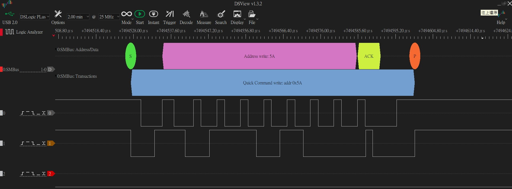


```text
SMBus quick read addr7=0x5A
```

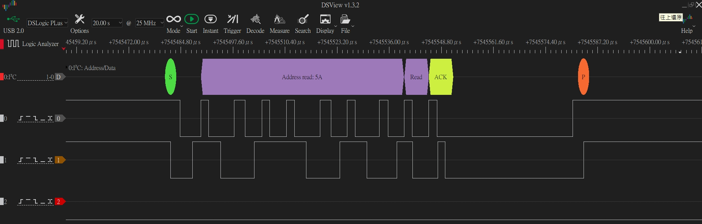


```text
SMBus RX cmd=0x10 (SMB_EXAMPLE_SEND_BYTE_A) raw=2 payload=0 proto=1 rs=0 pec=1 valid=1
address=0xB4:[0x10],[0x6B],
SMBus write done cmd=0x10 len=0
```

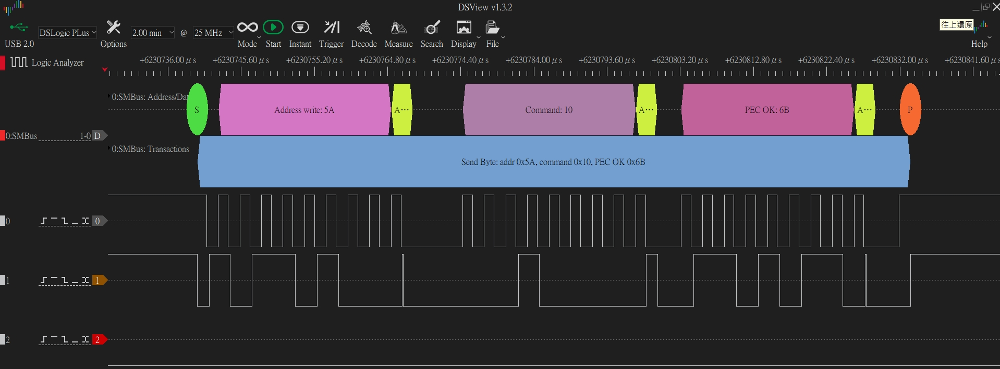


```text
SMBus RX cmd=0x11 (SMB_EXAMPLE_SEND_BYTE_B) raw=2 payload=0 proto=1 rs=0 pec=1 valid=1
address=0xB4:[0x11],[0x6C],
SMBus write done cmd=0x11 len=0
```

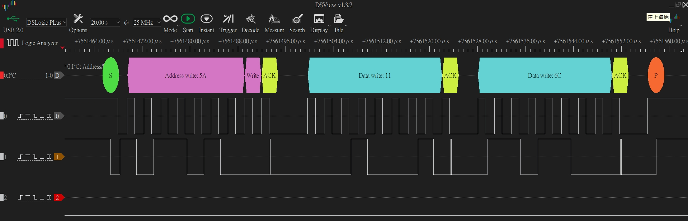


```text
SMBus RX cmd=0x12 (SMB_EXAMPLE_RECEIVE_SELECT_A) raw=2 payload=0 proto=1 rs=0 pec=1 valid=1
address=0xB4:[0x12],[0x65],
SMBus write done cmd=0x12 len=0
```

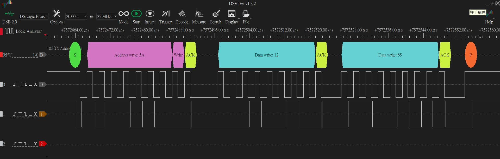


```text
SMBus TX cmd=0x00 (UNKNOWN) proto=2 (RECEIVE_BYTE) len=2 raw=02 | PEC OK | PEC(tx=0x00, calc=0x00)
```

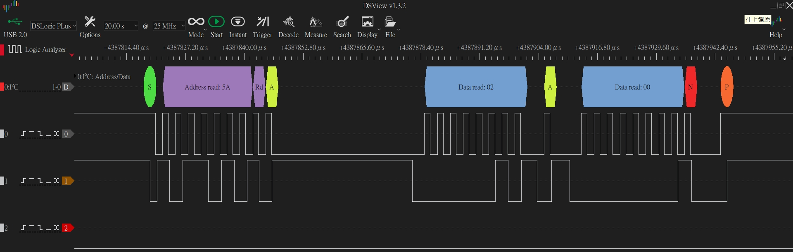


```text
SMBus RX cmd=0x13 (SMB_EXAMPLE_RECEIVE_SELECT_B) raw=2 payload=0 proto=1 rs=0 pec=1 valid=1
address=0xB4:[0x13],[0x62],
SMBus write done cmd=0x13 len=0
```

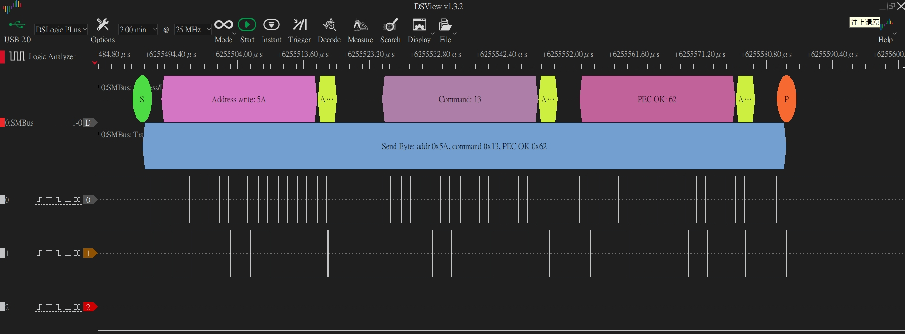


```text
SMBus TX cmd=0x00 (UNKNOWN) proto=2 (RECEIVE_BYTE) len=2 raw=82 | PEC OK | PEC(tx=0x89, calc=0x89)
```

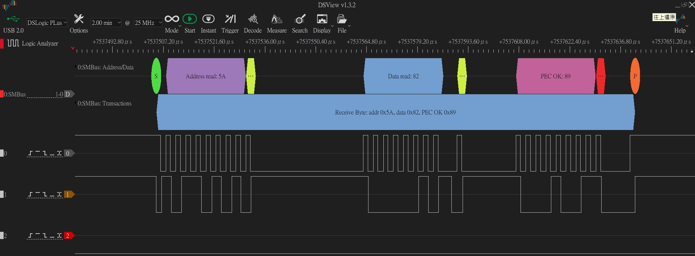


```text
SMBus RX cmd=0x20 (SMB_EXAMPLE_WRITE_BYTE_A) raw=3 payload=1 proto=3 rs=0 pec=1 valid=1
address=0xB4:[0x20],[0x00],[0xEF],
SMBus write done cmd=0x20 len=1
```

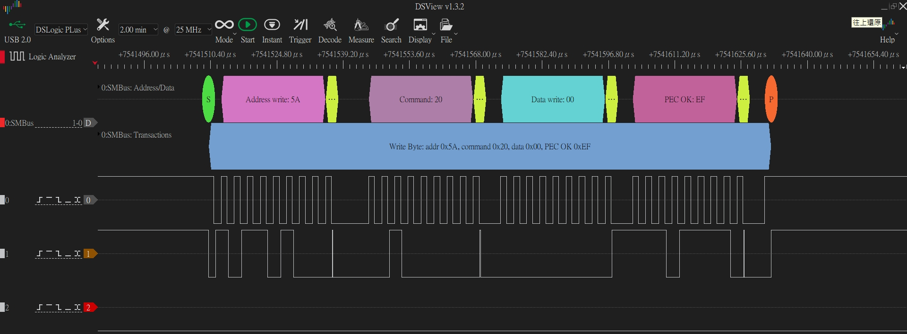


```text
SMBus RX cmd=0x21 (SMB_EXAMPLE_WRITE_BYTE_B) raw=3 payload=1 proto=3 rs=0 pec=1 valid=1
address=0xB4:[0x21],[0x81],[0x74],
SMBus write done cmd=0x21 len=1
```

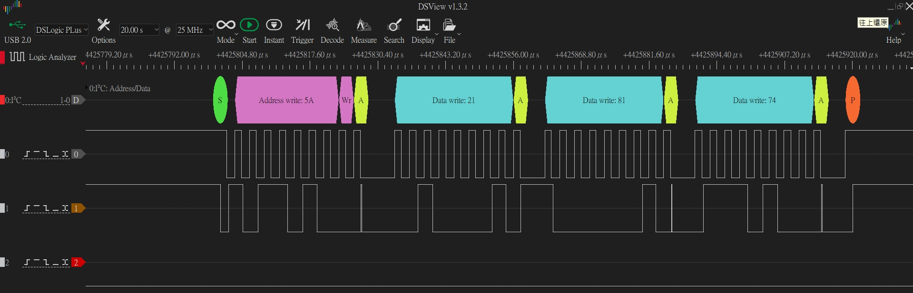


```text
SMBus RX cmd=0x22 (SMB_EXAMPLE_READ_BYTE_A) raw=1 payload=0 proto=5 rs=1 pec=0 valid=1
address=0xB4:[0x22],
SMBus TX cmd=0x22 (SMB_EXAMPLE_READ_BYTE_A) proto=5 (READ_BYTE) len=2 raw=01 | PEC OK | PEC(tx=0x5C, calc=0x5C)
```

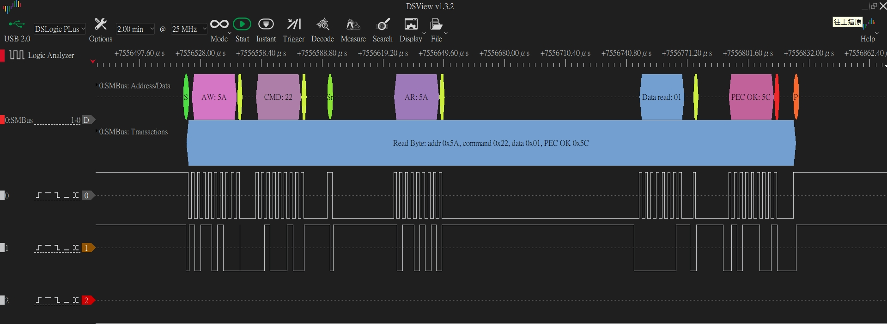


```text
SMBus RX cmd=0x23 (SMB_EXAMPLE_READ_BYTE_B) raw=1 payload=0 proto=5 rs=1 pec=0 valid=1
address=0xB4:[0x23],
SMBus TX cmd=0x23 (SMB_EXAMPLE_READ_BYTE_B) proto=5 (READ_BYTE) len=2 raw=81 | PEC OK | PEC(tx=0xBE, calc=0xBE)
```

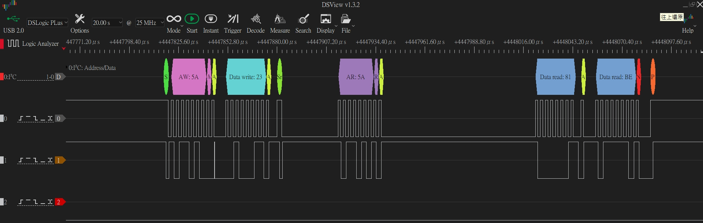


```text
SMBus RX cmd=0x30 (SMB_EXAMPLE_WRITE_WORD_A) raw=4 payload=2 proto=4 rs=0 pec=1 valid=1
address=0xB4:[0x30],[0x34],[0x02],[0x82],
SMBus write done cmd=0x30 len=2
```

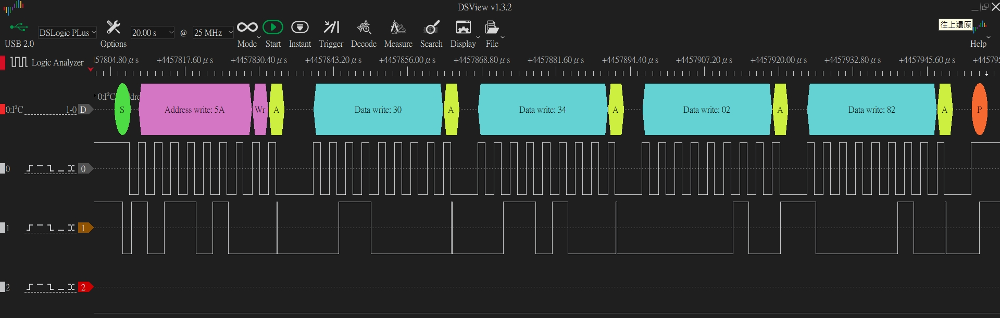


```text
SMBus RX cmd=0x31 (SMB_EXAMPLE_WRITE_WORD_B) raw=4 payload=2 proto=4 rs=0 pec=1 valid=1
address=0xB4:[0x31],[0xCD],[0x83],[0xCE],
SMBus write done cmd=0x31 len=2
```

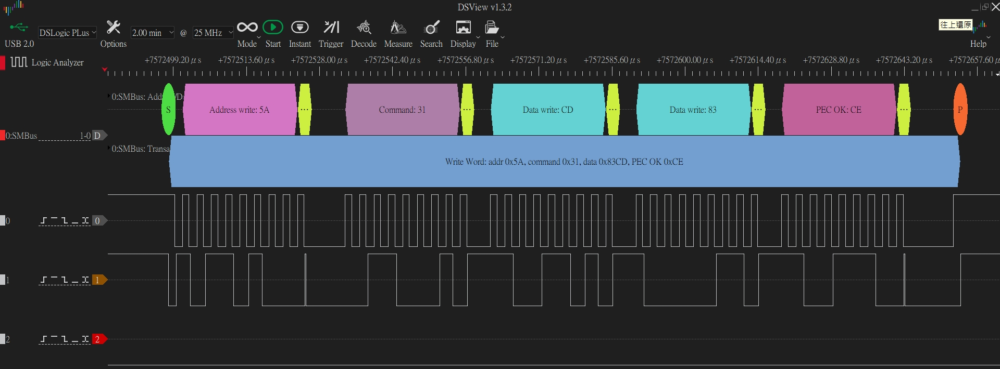


```text
SMBus RX cmd=0x32 (SMB_EXAMPLE_READ_WORD_A) raw=1 payload=0 proto=6 rs=1 pec=0 valid=1
address=0xB4:[0x32],
SMBus TX cmd=0x32 (SMB_EXAMPLE_READ_WORD_A) proto=6 (READ_WORD) len=3 raw=32 01 | PEC OK | PEC(tx=0x35, calc=0x35)
```

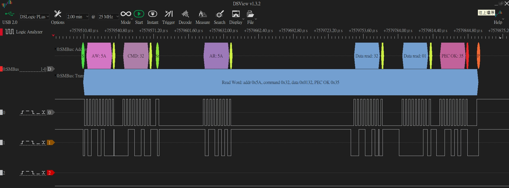


```text
SMBus RX cmd=0x33 (SMB_EXAMPLE_READ_WORD_B) raw=1 payload=0 proto=6 rs=1 pec=0 valid=1
address=0xB4:[0x33],
SMBus TX cmd=0x33 (SMB_EXAMPLE_READ_WORD_B) proto=6 (READ_WORD) len=3 raw=33 81 | PEC OK | PEC(tx=0xBF, calc=0xBF)
```

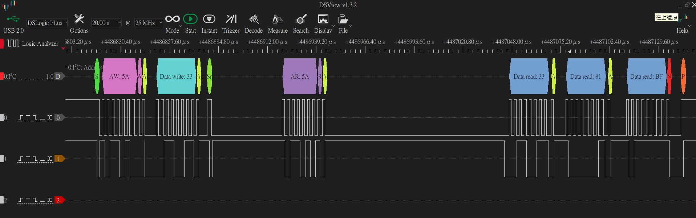


```text
SMBus RX cmd=0x40 (SMB_EXAMPLE_BLOCK_WRITE_A) raw=11 payload=9 proto=7 rs=0 pec=1 valid=1
address=0xB4:[0x40],[0x08],[0x10],[0x11],[0x12],[0x13],[0x14],[0x15],
[0x16],[0x04],[0x43],
SMBus write done cmd=0x40 len=9
```

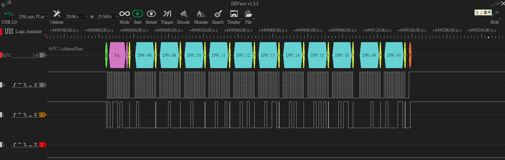


```text
SMBus RX cmd=0x41 (SMB_EXAMPLE_BLOCK_WRITE_B) raw=19 payload=17 proto=7 rs=0 pec=1 valid=1
address=0xB4:[0x41],[0x10],[0x20],[0x21],[0x22],[0x23],[0x24],[0x25],
[0x26],[0x27],[0x28],[0x29],[0x2A],[0x2B],[0x2C],[0x2D],
[0x2E],[0x85],[0x6D],
SMBus write done cmd=0x41 len=17
```

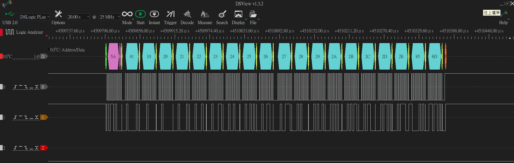


```text
SMBus RX cmd=0x42 (SMB_EXAMPLE_BLOCK_READ_A) raw=1 payload=0 proto=8 rs=1 pec=0 valid=1
address=0xB4:[0x42],
SMBus TX cmd=0x42 (SMB_EXAMPLE_BLOCK_READ_A) proto=8 (BLOCK_READ) len=10 raw=08 10 11 12 13 14 15 16 01 | PEC OK | PEC(tx=0xAB, calc=0xAB)
```

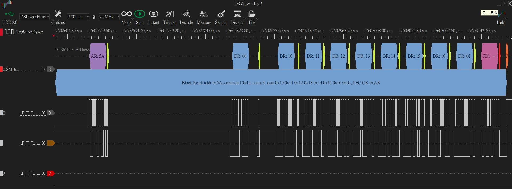


```text
SMBus RX cmd=0x43 (SMB_EXAMPLE_BLOCK_READ_B) raw=1 payload=0 proto=8 rs=1 pec=0 valid=1
address=0xB4:[0x43],
SMBus TX cmd=0x43 (SMB_EXAMPLE_BLOCK_READ_B) proto=8 (BLOCK_READ) len=18 raw=10 20 21 22 23 24 25 26 27 28 29 2A 2B 2C 2D 2E 81 | PEC OK | PEC(tx=0x82, calc=0x82)
```

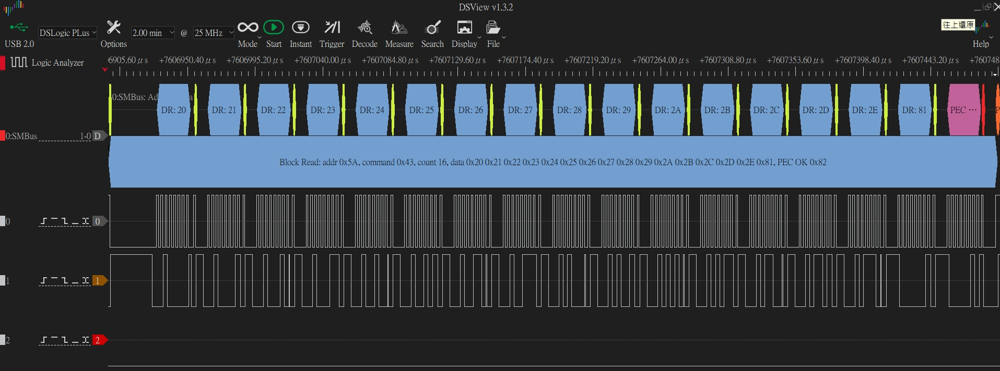


```text
SMBus RX cmd=0x50 (SMB_EXAMPLE_PROCESS_CALL_A) raw=3 payload=2 proto=9 rs=1 pec=0 valid=1
address=0xB4:[0x50],[0x34],[0x06],
SMBus TX cmd=0x50 (SMB_EXAMPLE_PROCESS_CALL_A) proto=9 (PROCESS_CALL) len=3 raw=45 01 | PEC OK | PEC(tx=0xFF, calc=0xFF)
```

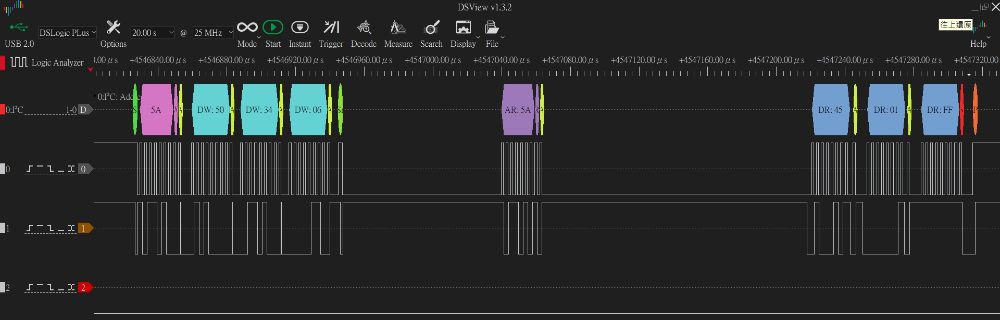


```text
SMBus RX cmd=0x51 (SMB_EXAMPLE_PROCESS_CALL_B) raw=3 payload=2 proto=9 rs=1 pec=0 valid=1
address=0xB4:[0x51],[0xCD],[0x87],
SMBus TX cmd=0x51 (SMB_EXAMPLE_PROCESS_CALL_B) proto=9 (PROCESS_CALL) len=3 raw=32 81 | PEC OK | PEC(tx=0xC3, calc=0xC3)
```

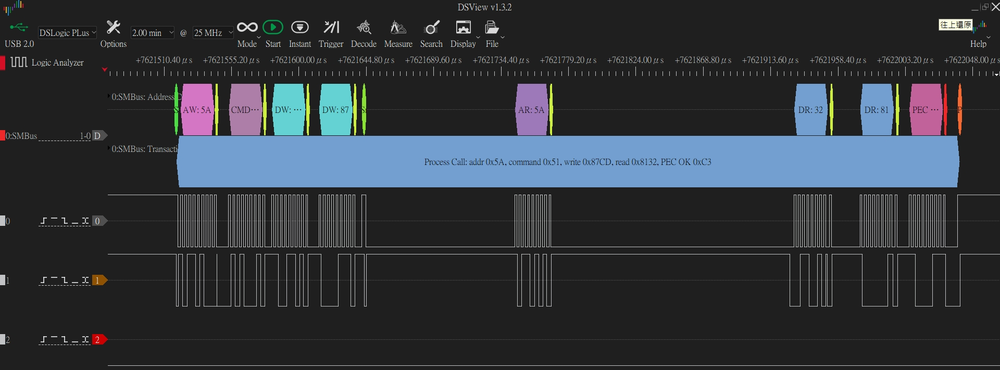


```text
SMBus RX cmd=0x60 (SMB_EXAMPLE_BLOCK_PROC_CALL_A) raw=10 payload=9 proto=10 rs=1 pec=0 valid=1
address=0xB4:[0x60],[0x08],[0x01],[0x02],[0x03],[0x04],[0x05],[0x06],
[0x07],[0x08],
SMBus TX cmd=0x60 (SMB_EXAMPLE_BLOCK_PROC_CALL_A) proto=10 (BLOCK_WRITE_READ_PROCESS_CALL) len=10 raw=08 02 03 04 05 06 07 08 01 | PEC OK | PEC(tx=0xEC, calc=0xEC)
```

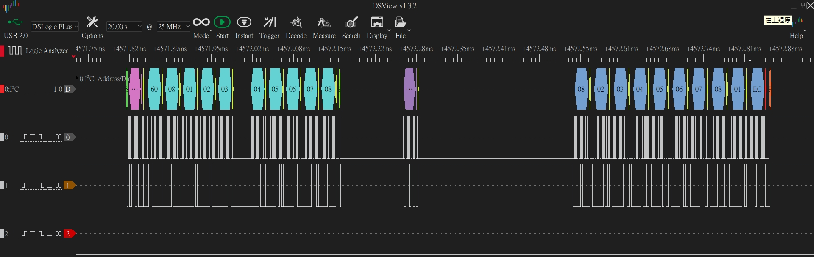


```text
SMBus RX cmd=0x61 (SMB_EXAMPLE_BLOCK_PROC_CALL_B) raw=18 payload=17 proto=10 rs=1 pec=0 valid=1
address=0xB4:[0x61],[0x10],[0x11],[0x12],[0x13],[0x14],[0x15],[0x16],
[0x17],[0x18],[0x19],[0x1A],[0x1B],[0x1C],[0x1D],[0x1E],
[0x1F],[0x89],
SMBus TX cmd=0x61 (SMB_EXAMPLE_BLOCK_PROC_CALL_B) proto=10 (BLOCK_WRITE_READ_PROCESS_CALL) len=18 raw=10 89 1F 1E 1D 1C 1B 1A 19 18 17 16 15 14 13 12 81 | PEC OK | PEC(tx=0x7B, calc=0x7B)
```

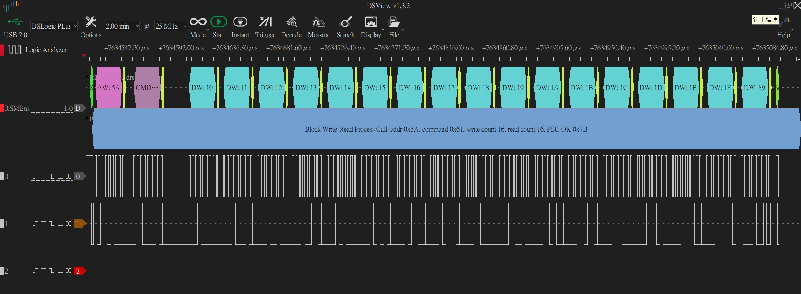

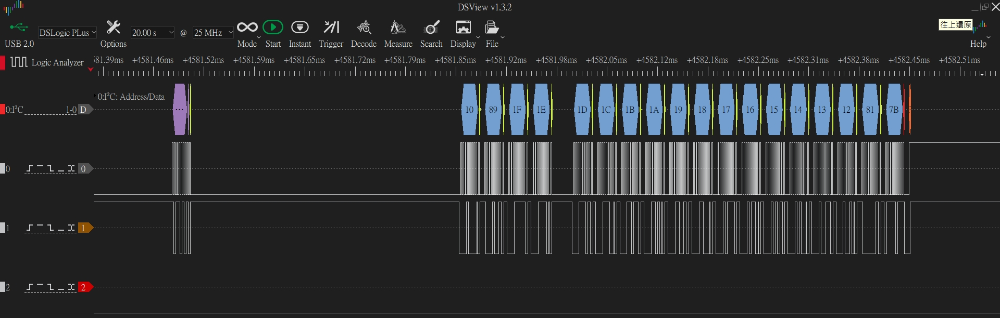


```text
SMBus RX cmd=0x20 (SMB_EXAMPLE_WRITE_BYTE_A) raw=3 payload=1 proto=3 rs=0 pec=1 valid=0
address=0xB4:[0x20],[0x4A],[0xE1],
SMBus PEC error cmd=0x20 frame=3
```

This frame is the intentional Bad PEC negative test from the host. The correct
PEC for `0xB4 0x20 0x4A` is `0x1E`, but the host sends `0xE1` to verify that
the slave detects and reports the PEC failure.

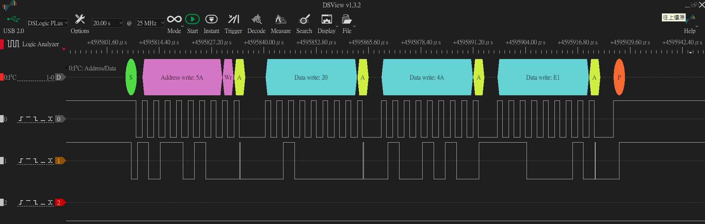

### UBM Controller Profile Signals

The captures below are UBM Controller profile examples from `teraterm_UBM.log`
and the `UBM_*` LA screenshots. The paired validation-tool run passed three
consecutive UBM `Run All` passes with `PASS=32 FAIL=0`.

UBM Controller transactions use the SFF-TA-1005 checksum seed `0xA5`, not SMBus
PEC. For LA correlation:

- UBM read command phase: `addr(W) + command + command-checksum`, then repeated
  START, then `addr(R) + response-data + response-checksum`.
- UBM write command phase: `addr(W) + command + payload + write-checksum`.
- Command checksum is calculated over `addr(W) + command`.
- Write checksum is calculated over `addr(W) + command + payload`.
- Read response checksum is calculated over the returned response bytes.

The first UBM `Run All` starts with these reads:

```text
SMBus RX cmd=0x00 (UBM_OPERATIONAL_STATE) raw=2 payload=1 proto=11 rs=1 pec=0 valid=1
address=0xB4:[0x00],[0xA7],
SMBus TX cmd=0x00 (UBM_OPERATIONAL_STATE) proto=11 (UBM_CONTROLLER_READ) len=2 raw=03 58
```

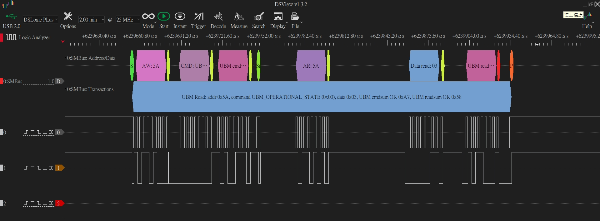


```text
SMBus RX cmd=0x01 (UBM_LAST_COMMAND_STATUS) raw=2 payload=1 proto=11 rs=1 pec=0 valid=1
address=0xB4:[0x01],[0xA6],
SMBus TX cmd=0x01 (UBM_LAST_COMMAND_STATUS) proto=11 (UBM_CONTROLLER_READ) len=2 raw=01 5A
```

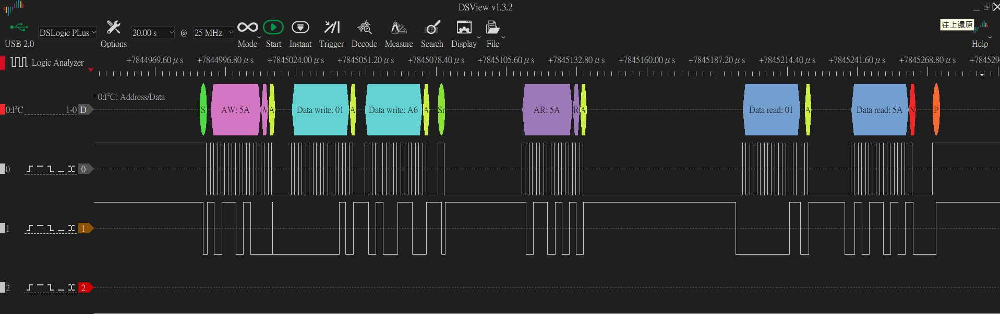


```text
SMBus RX cmd=0x02 (UBM_SILICON_IDENTITY_VERSION) raw=2 payload=1 proto=11 rs=1 pec=0 valid=1
address=0xB4:[0x02],[0xA5],
SMBus TX cmd=0x02 (UBM_SILICON_IDENTITY_VERSION) proto=11 (UBM_CONTROLLER_READ) len=15 raw=15 AB 10 00 32 00 00 00 00 00 00 01 55 42 C1
```

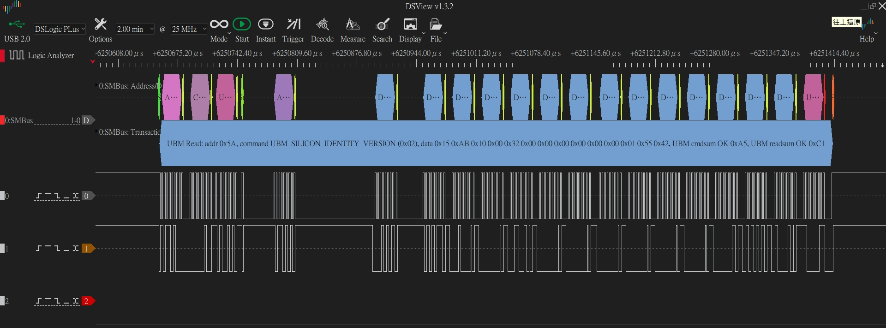


```text
SMBus RX cmd=0x03 (UBM_PROGRAMMING_UPDATE_MODE_CAPABILITIES) raw=2 payload=1 proto=11 rs=1 pec=0 valid=1
address=0xB4:[0x03],[0xA4],
SMBus TX cmd=0x03 (UBM_PROGRAMMING_UPDATE_MODE_CAPABILITIES) proto=11 (UBM_CONTROLLER_READ) len=2 raw=01 5A
```

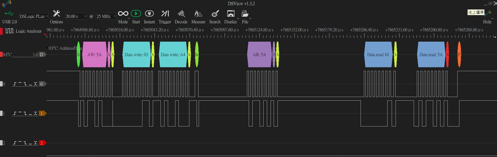


```text
SMBus RX cmd=0x30 (UBM_HOST_FACING_CONNECTOR_INFO) raw=2 payload=1 proto=11 rs=1 pec=0 valid=1
address=0xB4:[0x30],[0x77],
SMBus TX cmd=0x30 (UBM_HOST_FACING_CONNECTOR_INFO) proto=11 (UBM_CONTROLLER_READ) len=2 raw=01 5A
```

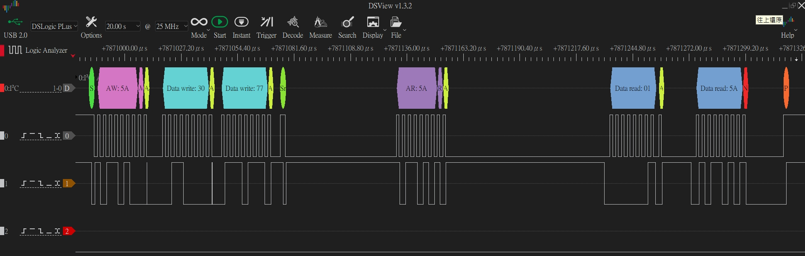


```text
SMBus RX cmd=0x31 (UBM_BACKPLANE_INFO) raw=2 payload=1 proto=11 rs=1 pec=0 valid=1
address=0xB4:[0x31],[0x76],
SMBus TX cmd=0x31 (UBM_BACKPLANE_INFO) proto=11 (UBM_CONTROLLER_READ) len=2 raw=01 5A
```

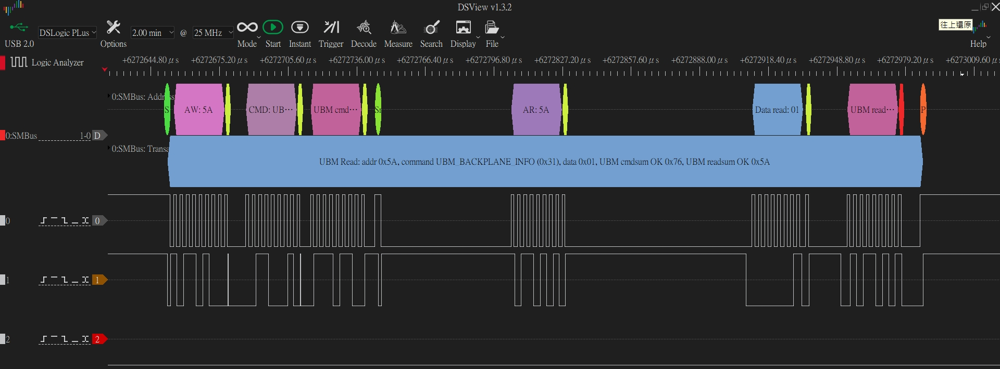


```text
SMBus RX cmd=0x32 (UBM_STARTING_SLOT) raw=2 payload=1 proto=11 rs=1 pec=0 valid=1
address=0xB4:[0x32],[0x75],
SMBus TX cmd=0x32 (UBM_STARTING_SLOT) proto=11 (UBM_CONTROLLER_READ) len=2 raw=00 5B
```

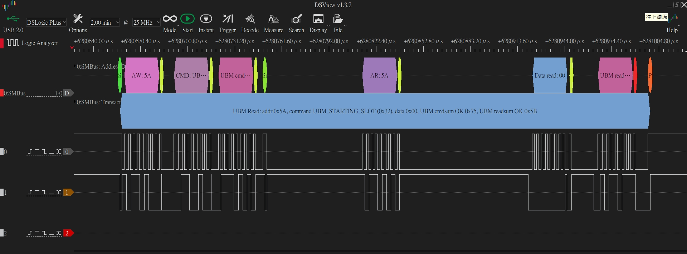


```text
SMBus RX cmd=0x33 (UBM_CAPABILITIES) raw=2 payload=1 proto=11 rs=1 pec=0 valid=1
address=0xB4:[0x33],[0x74],
SMBus TX cmd=0x33 (UBM_CAPABILITIES) proto=11 (UBM_CONTROLLER_READ) len=3 raw=80 60 7B
```

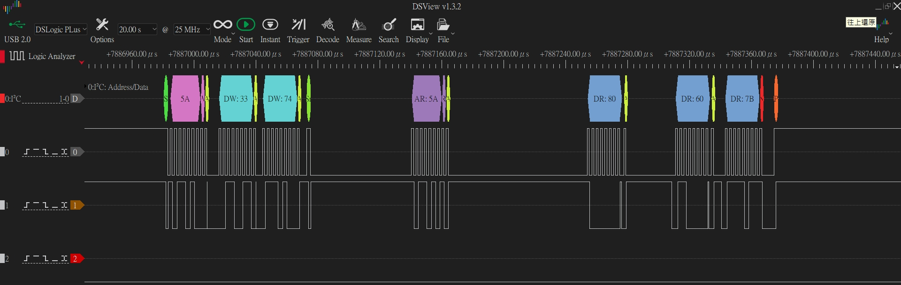


```text
SMBus RX cmd=0x34 (UBM_FEATURES) raw=2 payload=1 proto=11 rs=1 pec=0 valid=1
address=0xB4:[0x34],[0x73],
SMBus TX cmd=0x34 (UBM_FEATURES) proto=11 (UBM_CONTROLLER_READ) len=3 raw=00 00 5B
```

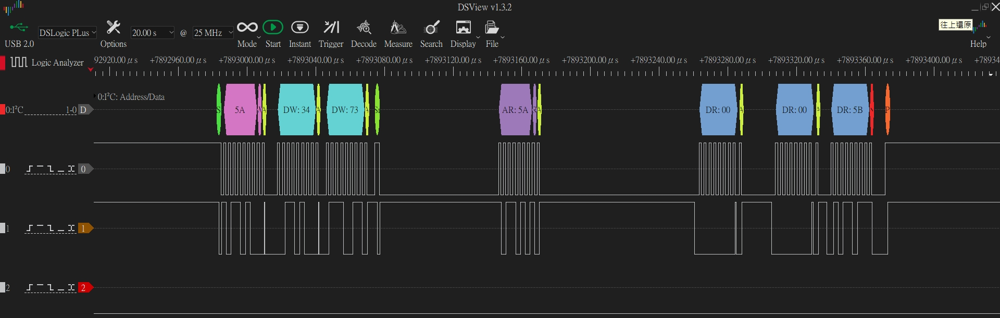

The same UBM run also validates update-mode shell transitions and checksum
negative behavior. The LA byte summaries for the first run are:

| Validation item | LA byte summary | Expected result |
| --- | --- | --- |
| Enter update read shell | `W=[20 87] R=[B8 55 42 4D 00 BF]` | Returns advertised update-mode write address `0xB8` plus shell signature. |
| Enter update write shell | `W=[20 B8 55 42 4D 01 EA]` | Accepted write; subsequent Operational State is reduced. |
| Operational State after enter | `W=[00 A7] R=[04 57]` | `0x04` REDUCED FUNCTIONALITY. |
| PMDT write shell | `W=[21 00 02 AA 55 85]` | Accepted programmable-mode data shadow write. |
| Exit update read shell | `W=[22 85] R=[55 42 4D 00 77]` | Returns exit shell signature. |
| Exit update write shell | `W=[22 55 42 4D 01 A0]` | Accepted write; subsequent Operational State is ready. |
| Operational State after exit | `W=[00 A7] R=[03 58]` | `0x03` READY. |
| Bad checksum negative | `W=[34 00 00 8C]` then `W=[01 A6] R=[02 59]` | Last Command Status becomes `0x02` INVALID_CHECKSUM. |

## Configuration Files

Primary configuration points:

```text
SampleCode/Template/board_config.h
SampleCode/Template/smbus/smbus_cfg_user.h
SampleCode/Template/smbus/smbus_protocol.h
```

`smbus_cfg_user.h` holds portable SMBus user settings shared by M031/M032 and
future ports. Change this file for PEC policy/backend, address defaults, debug
output, buffer sizes, and recovery thresholds.

`smbus_protocol.h` holds fixed protocol constants such as `SMBUS_PROTOCOL_*`,
`SMBUS_STATUS_*`, and `SMBUS_I2C_STATUS_*` ISR state codes. These values are
used by the framework and should not be treated as user-configurable settings.

Address settings:

| Define | Default | Purpose |
| --- | --- | --- |
| `SMBUS_ADDRESS_7BIT_BASE` | `0x58U` | Base SMBus 7-bit address reference. |
| `SMBUS_ADDRESS_STRAP_00_7BIT` | `0x58U` | Address strap result for A1/A0 = 00. |
| `SMBUS_ADDRESS_STRAP_01_7BIT` | `0x59U` | Address strap result for A1/A0 = 01. |
| `SMBUS_ADDRESS_STRAP_10_7BIT` | `0x5AU` | Address strap result for A1/A0 = 10. |
| `SMBUS_ADDRESS_STRAP_11_7BIT` | `0x5BU` | Address strap result for A1/A0 = 11. |
| `SMBUS_ADDRESS_INVALID_FALLBACK_7BIT` | `SMBUS_ADDRESS_STRAP_10_7BIT` | Safe fallback when strap input is invalid. |
| `SMBUS_ADDRESS_7BIT_TO_WRITE(addr7)` | `(addr7 << 1)` | Converts a 7-bit address to the 8-bit write address shown by LA tools. |
| `SMBUS_ADDRESS_7BIT_TO_READ(addr7)` | `((addr7 << 1) | 1)` | Converts a 7-bit address to the 8-bit read address shown by LA tools. |

SMBALERT#/ARA transport settings:

| Define | Default | Purpose |
| --- | --- | --- |
| `SMBUS_ALERT_RESPONSE_ADDRESS_7BIT` | `0x0CU` | SMBus Alert Response Address used for ARA receive-byte transport. |
| `SMBUS_ENABLE_ALERT_SERVICE` | `1U` | Builds the generic ALERT# drive/release APIs. This does not create any product fault policy. |
| `SMBUS_ENABLE_ARA_ALIAS` | Derived from `SMBUS_ENABLE_ALERT_SERVICE` | Enables the ARA alias transport while ALERT# is asserted. |
| `SMBUS_I2C_ALIAS_SLOT_DISABLED` | `0xFFU` | Sentinel for platforms that do not have a hardware secondary address slot. |
| `SMBUS_I2C_ALIAS_SLOT_ARA` | `1U` | Platform alias slot used for ARA. |

Profile and UBM settings:

| Define | Default | Purpose |
| --- | --- | --- |
| `SMBUS_SAMPLE_PROFILE_GENERIC` | `0U` | Builds the pure SMBus transaction-layer example map. |
| `SMBUS_SAMPLE_PROFILE_UBM` | `1U` | Builds the SFF-TA-1005 UBM Controller shell. |
| `SMBUS_SAMPLE_PROFILE` | `SMBUS_SAMPLE_PROFILE_UBM` in the checked-in sample | Selects the active sample profile. |
| `SMBUS_UBM_CONTROLLER_ADDRESS_7BIT` | `SMBUS_ADDRESS_INVALID_FALLBACK_7BIT` | 7-bit UBM Controller address. Default resolves to `0x5A`. |
| `SMBUS_UBM_UPDATE_ADDRESS_7BIT` | `0x5CU` | Placeholder 7-bit update-mode target address advertised by the sample command shell. |
| `SMBUS_UBM_CHECKSUM_SEED` | `0xA5U` | UBM Controller checksum seed. This is not SMBus PEC. |
| `SMBUS_UBM_DESCRIPTOR_COUNT` | `2U` | Number of sample DFC descriptors exposed by the UBM Controller profile. |

PEC and debug settings:

| Define | Default | Purpose |
| --- | --- | --- |
| `SMBUS_PEC_POLICY_DISABLED` | `0U` | Disables PEC generation/validation. |
| `SMBUS_PEC_POLICY_OPTIONAL` | `1U` | Accepts transactions with or without PEC, validates PEC when present, and appends read PEC. |
| `SMBUS_PEC_POLICY_REQUIRED` | `2U` | Requires PEC for write-side transactions. |
| `SMBUS_PEC_POLICY` | `SMBUS_PEC_POLICY_OPTIONAL` | Active PEC policy. Use disabled mode only for explicit bring-up tests. |
| `SMBUS_ENABLE_PEC` | Derived | Non-zero when `SMBUS_PEC_POLICY` is not disabled. |
| `SMBUS_PEC_BACKEND_SOFTWARE` | `0U` | Uses the portable CRC-8 implementation. |
| `SMBUS_PEC_BACKEND_HW_CRC` | `1U` | Uses the NuMicro CRC peripheral. |
| `SMBUS_PEC_BACKEND` | `SMBUS_PEC_BACKEND_HW_CRC` | Selects the PEC CRC backend. |
| `SMBUS_DEBUG_ENABLE` | `1U` | Enables queued background debug output. |
| `SMBUS_DEBUG_PRINT_RX_FRAME` | `1U` | Prints decoded RX frames. |
| `SMBUS_DEBUG_PRINT_TX_READY` | `1U` | Prints prepared TX frames. |
| `SMBUS_DEBUG_PRINT_TX_DECODE` | `1U` | Prints raw TX bytes and PEC status. |
| `SMBUS_DEBUG_PRINT_WRITE_DONE` | `1U` | Prints completed write summaries. |
| `SMBUS_DEBUG_PRINT_STATUS` | `0U` | Optional low-level I2C status logging. Usually kept off to avoid log noise. |

Buffer and recovery settings:

| Define | Default | Purpose |
| --- | --- | --- |
| `SMBUS_RX_BUFFER_SIZE` | `40U` | Fixed RX buffer size. |
| `SMBUS_TX_BUFFER_SIZE` | `40U` | Fixed TX buffer size, sized for 32-byte SMBus block data plus UBM descriptor/checksum headroom. |
| `SMBUS_MAX_BLOCK_SIZE` | `32U` | Maximum SMBus block payload length. |
| `SMBUS_DEBUG_QUEUE_SIZE` | `64U` | Background debug event queue depth. |
| `SMBUS_DEBUG_FRAME_QUEUE_SIZE` | `16U` | RX frame snapshot queue depth. |
| `SMBUS_DEBUG_TX_QUEUE_SIZE` | `16U` | TX response snapshot queue depth. |
| `SMBUS_ENABLE_SLAVE_RECOVER` | `1U` | Enables stuck-bus / timeout recovery path. |
| `SMBUS_I2C_CLOCK_LOW_TIMEOUT_MS` | `35U` | Software SCL-low timeout threshold sampled from the 1 ms timer ISR. |
| `SMBUS_I2C_TIMEOUT_RECOVER_THRESHOLD` | `1U` | Timeout flag threshold before recovery. |
| `SMBUS_I2C_BUS_ERROR_RECOVER_THRESHOLD` | `1U` | Bus-error threshold before recovery. |
| `SMBUS_I2C_BUS_CLEAR_PULSES` | `9U` | SCL pulses used for bus-clear recovery. |
| `SMBUS_I2C_BUS_CLEAR_RETRY_COUNT` | `3U` | Bus-clear retry attempts. |
| `SMBUS_I2C_RECOVER_MAX_ATTEMPTS` | `3U` | Maximum SMBus slave recover attempts before fail event. |
| `SMBUS_I2C_RECOVER_BACKOFF_CYCLES` | `2U` | Background-task backoff cycles before recover. |
| `SMBUS_I2C_STUCK_BUS_RETRY_CYCLES` | `50U` | Debounce count before stuck-bus recovery is requested. |

`board_config.h` holds the platform porting contract. For a new MCU family or
another I2C instance, keep the SMBus common files unchanged and select or add a
`SMBUS_PORT_OPTION` in `board_config.h`.

| Define group | Current M031/M032 value / behavior |
| --- | --- |
| Port option | Default `SMBUS_PORT_OPTION_M031_I2C0_PB4_PB5`; alternate example `SMBUS_PORT_OPTION_M031_I2C1_PA2_PA3`. |
| Address defaults | `SMBUS_DEFAULT_ADDRESS_A0_LEVEL=0U`, `SMBUS_DEFAULT_ADDRESS_A1_LEVEL=1U`, resulting in default 7-bit address `0x5A`. |
| I2C instance | Selected by option through `SMBUS_PORT_I2C_INSTANCE`, `SMBUS_PORT_I2C_MODULE`, `SMBUS_PORT_I2C_IRQn`, and `SMBUS_PORT_I2C_IRQHandler`. |
| Pin names | Selected by option through `SMBUS_PORT_I2C_NAME`, `SMBUS_PORT_SCL_PIN_NAME`, and `SMBUS_PORT_SDA_PIN_NAME`. |
| Bus clock | `SMBUS_PORT_I2C_BUS_CLOCK=400000UL`. |
| ISR contract | `SMBUS_PORT_I2C_IRQHandler` and `SMBUS_PORT_I2C_ISR_PROTOTYPE`. |
| Debug print | `SMBUS_DEBUG_PRINT=printf`. |
| Pin MFP / GPIO macros | `SMBUS_PORT_SET_I2C_PINS_MFP`, `SMBUS_PORT_SET_I2C_PINS_GPIO`, `SMBUS_PORT_INIT_I2C_PINS`, bus-clear SCL/SDA read/drive macros. |
| SMBALERT# macros | `SMBUS_PORT_ALERT_PIN_NAME`, `SMBUS_PORT_INIT_ALERT_PIN`, `SMBUS_PORT_ALERT_ASSERT`, and `SMBUS_PORT_ALERT_RELEASE`. Current sample uses `PB6/SMBALERT#` open-drain. |
| Address strap macros | `SMBUS_ADDRESS_STRAP_USE_GPIO`, `SMBUS_PORT_INIT_ADDRESS_PINS`, `SMBUS_PORT_READ_ADDRESS_A0`, `SMBUS_PORT_READ_ADDRESS_A1`. |

## Debug Logging

Debug logging is intentionally human-readable and transaction-aware. RX debug
frames include command byte and command name when known. TX debug logs print raw
response bytes and PEC status so GUI logs can be correlated with MCU-side source
values.

Do not print from timing-critical ISR paths. Queue or capture data in ISR and
print from background processing.

RX debug logs use two lines:

```text
SMBus RX cmd=0x20 (SMB_EXAMPLE_WRITE_BYTE_A) raw=3 payload=1 proto=3 rs=0 pec=1 valid=1
address=0xB4:[0x20],[0x00],[0xEF],
```

The `address=0xB4` field is the 8-bit write address observed by the logic
analyzer. The bracketed byte list is the complete RX byte stream captured after
the address byte, from command byte through payload and optional PEC. For LA
comparison, treat the frame as:

```text
[SLV write address],[command byte],...[PEC]
```

Quick Read and Receive Byte are intentionally different. Quick Read is
address-only and logs as `SMBus quick read addr7=0x5A`; no data byte is clocked
by the host. Receive Byte clocks data from the slave, so the MCU TX log reports
`cmd=0x00 (UNKNOWN) proto=2 (RECEIVE_BYTE)` because this transaction is pure
address-read plus data.

PEC CRC backend selection is independent from PEC policy. `SMBUS_PEC_POLICY`
decides whether PEC is disabled, optional, or required. `SMBUS_PEC_BACKEND`
only decides whether the CRC-8 math uses software or the platform hardware CRC
peripheral.

In the UBM profile, the UBM Controller path intentionally reports `pec=0`
because SFF-TA-1005 Controller commands use the `0xA5` seed checksum described
above, not SMBus PEC. For UBM Controller reads, the final response byte is the
UBM checksum and is verified by the host validation tool.

SMBus PEC framing rules used by this firmware:

- `Write Byte w/PEC`: the host/master sends `addr(W) + cmd + data + PEC`; the slave validates the write PEC.
- `Read Byte w/PEC`: the host/master sends `addr(W) + cmd`, then uses repeated START to read `data + PEC`; the slave appends the read PEC and the host validates it.
- `Receive Byte w/PEC`: the host/master sends `addr(R)` and reads `data + PEC`; the response PEC frame is `addr(R) + data`.
- For command-read combined transactions, the command/write phase does not append a request-side PEC byte. The response PEC frame is `addr(W) + cmd + optional write payload + addr(R) + response data`.

To switch PEC CRC implementation, set `SMBUS_PEC_BACKEND` in `smbus_cfg_user.h`:

```c
#define SMBUS_PEC_BACKEND SMBUS_PEC_BACKEND_SOFTWARE
#define SMBUS_PEC_BACKEND SMBUS_PEC_BACKEND_HW_CRC
```

## Known Constraints

- External pull-ups are required on SMBus SCL and SDA.
- Debug logging can change timing if used excessively; keep bus-critical behavior in ISR.
- The example command map is only for transaction-layer validation.
- Product command ownership must be added by the product firmware owner.
- VPP is intentionally not implemented as a profile in this workspace. Public
  material identifies it as an Intel/OEM vendor protocol over SMBus/I2C, but
  does not provide a complete common command flow suitable for a standards-backed
  validation shell.
- Forced clock-low/stuck-bus timeout injection still requires external lab setup or a dedicated master-side test path.

## Related Validation Documents

```text
SampleCode/Template/SMBUS_SUPPORT_MATRIX.md
SampleCode/Template/SMBUS_VALIDATION_CHECKLIST.md
Repository root: example SMBus LA screenshots
```

## Revision History

| Date | Change |
| --- | --- |
| 2026/06/26 | Created standalone SMBus transaction-layer workspace from the validation slave sample. |

## Mermaid Flow Charts

### Startup Flow

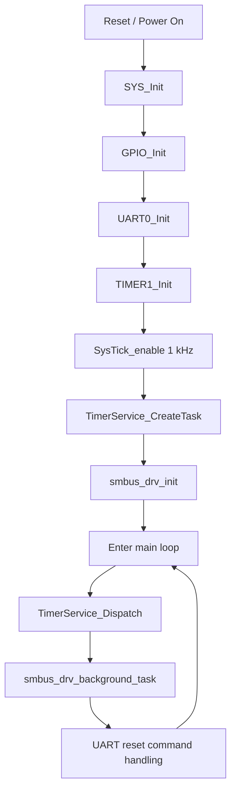
```mermaid
flowchart TD
    A[Reset / Power On] --> B[SYS_Init]
    B --> C[GPIO_Init]
    C --> D[UART0_Init]
    D --> E[TIMER1_Init]
    E --> F[SysTick_enable 1 kHz]
    F --> G[TimerService_CreateTask]
    G --> H[smbus_drv_init]
    H --> I[Enter main loop]
    I --> J[TimerService_Dispatch]
    J --> K[smbus_drv_background_task]
    K --> L[UART reset command handling]
    L --> I
```

### SMBus Transaction Flow

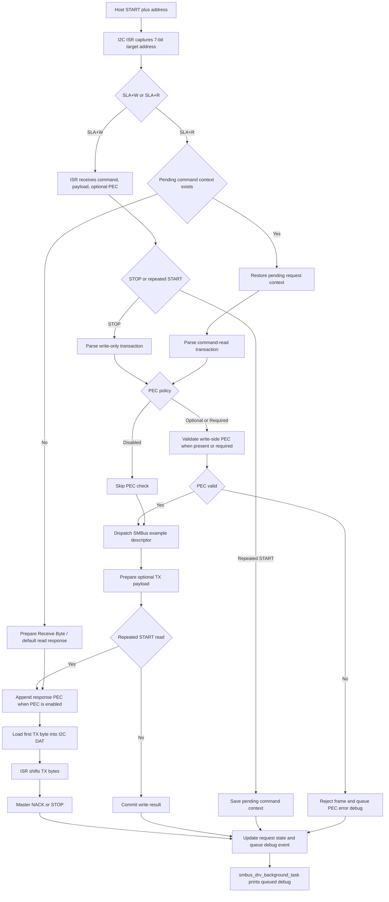
```mermaid
flowchart TD
    A[Host START plus address] --> B[I2C ISR captures 7-bit target address]
    B --> C{SLA+W or SLA+R}

    C -->|SLA+W| D[ISR receives command, payload, optional PEC]
    D --> E{STOP or repeated START}
    E -->|STOP| F[Parse write-only transaction]
    E -->|Repeated START| G[Save pending command context]

    C -->|SLA+R| H{Pending command context exists}
    H -->|Yes| I[Restore pending request context]
    I --> J[Parse command-read transaction]
    H -->|No| K[Prepare Receive Byte / default read response]

    F --> L{PEC policy}
    J --> L
    L -->|Disabled| M[Skip PEC check]
    L -->|Optional or Required| N[Validate write-side PEC when present or required]
    N --> O{PEC valid}
    O -->|No| P[Reject frame and queue PEC error debug]
    O -->|Yes| Q[Dispatch SMBus example descriptor]
    M --> Q
    Q --> R[Prepare optional TX payload]
    R --> S{Repeated START read}
    S -->|Yes| T[Append response PEC when PEC is enabled]
    S -->|No| U[Commit write result]
    T --> V[Load first TX byte into I2C DAT]
    K --> T
    V --> W[ISR shifts TX bytes]
    W --> X[Master NACK or STOP]
    X --> Y[Update request state and queue debug event]
    U --> Y
    G --> Y
    P --> Y
    Y --> Z[smbus_drv_background_task prints queued debug]
```

### Timeout And Recovery Flow

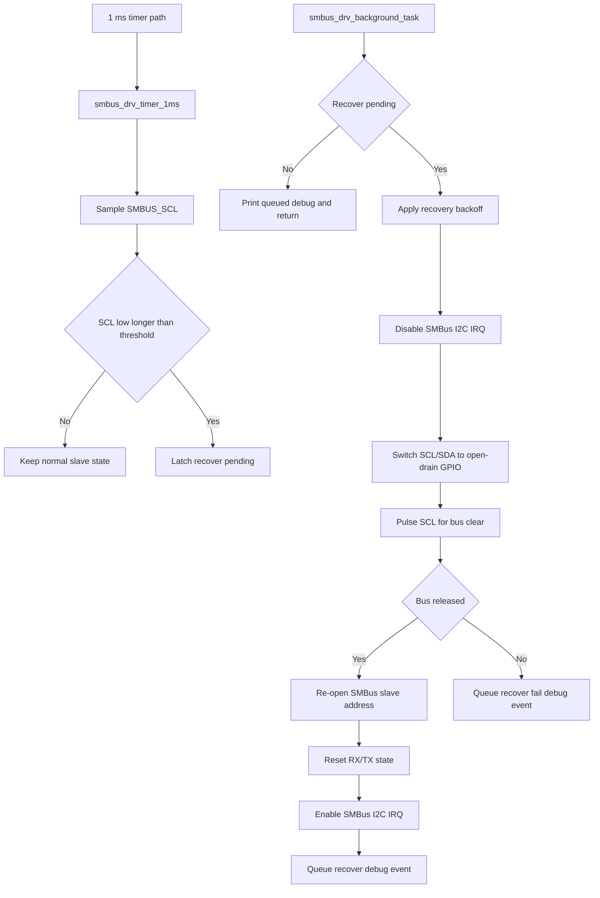
```mermaid
flowchart TD
    A[1 ms timer path] --> B[smbus_drv_timer_1ms]
    B --> C[Sample SMBUS_SCL]
    C --> D{SCL low longer than threshold}
    D -->|No| E[Keep normal slave state]
    D -->|Yes| F[Latch recover pending]

    G[smbus_drv_background_task] --> H{Recover pending}
    H -->|No| I[Print queued debug and return]
    H -->|Yes| J[Apply recovery backoff]
    J --> K[Disable SMBus I2C IRQ]
    K --> L[Switch SCL/SDA to open-drain GPIO]
    L --> M[Pulse SCL for bus clear]
    M --> N{Bus released}
    N -->|Yes| O[Re-open SMBus slave address]
    N -->|No| P[Queue recover fail debug event]
    O --> Q[Reset RX/TX state]
    Q --> R[Enable SMBus I2C IRQ]
    R --> S[Queue recover debug event]
```
